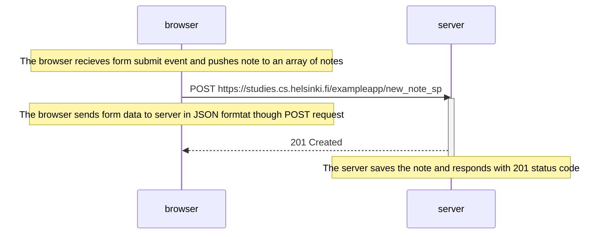

```mermaid
sequenceDiagram
participant browser
participant server

    note over browser: The browser recieves form submit event and pushes note to an array of notes
    browser->>server: POST https://studies.cs.helsinki.fi/exampleapp/new_note_sp
    activate server
    note over browser: The browser sends form data to server in JSON formtat though POST request
    server-->>browser: 201 Created
    note over server: The server saves the note and responds with 201 status code
    deactivate server
```
